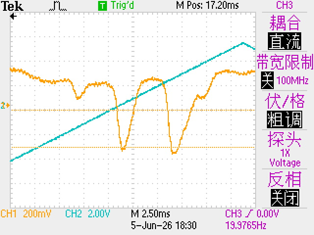
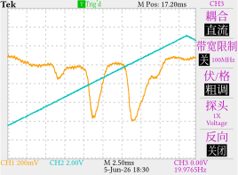

是的我用 Typst 复刻了一个示波器的截图。

---

:::expander Typst 代码

两个来自示波器的 CSV 文件：

- <a href="/assets/files/typst/oscilloscope/F0006CH1.CSV" target="_blank">F0006CH1.CSV</a>
- <a href="/assets/files/typst/oscilloscope/F0006CH2.CSV" target="_blank">F0006CH2.CSV</a>

```typst
#import "@preview/cetz:0.5.2": canvas, draw
#import "@preview/cetz-plot:0.1.4": plot
#set page(width: auto, height: auto, margin: 0pt)
#set text(font: ((name: "Libertinus Serif", covers: "latin-in-cjk"), "Source Han Serif SC"))

#show smartquote: set text(features: ("pwid",))
#block(fill: rgb("#EEE"), inset: (bottom: 2pt))[
  #set par(spacing: 0pt, leading: 2pt)
  #set text(0.8em, bottom-edge: "bounds", top-edge: "bounds")
  #let ch1-color = rgb("#FA9F07")
  #let ch2-color = rgb("#00C1BE")
  #let ch3-color = rgb("#bf15bf")
  #let stroke-color = rgb("#CBCBCB")
  #grid(
    columns: (auto, 47pt),
    grid(
      columns: 4,
      column-gutter: (7.9em, 0pt, 4.7em),
      align: horizon,
      text(1.2em)[*Tek*],
      box[#block(fill: rgb("#00BF00"), height: 1em, width: 1em)[
          #set align(center + horizon)
          #text(white, 0.7em)[T]]
      ],
      scale(x: 80%, reflow: true)[#text(fill: rgb("#00BF00"))[Trig'd]],
      [M Pos: 17.20ms],
    ),
    grid.cell(rowspan: 2)[
      #v(1pt)
      #set align(center)
      #set text(ch3-color)
      #set line(stroke: stroke-color)
      CH3
      #set text(13pt)
      #set par(spacing: 2.6pt)
      #line(length: 80%)
      耦合
      #block(fill: black, inset: 1pt)[
        #text(white)[直流]
      ]
      #line(length: 80%)
      #scale(x: 90%, reflow: true)[带宽限制]
      #grid(
        columns: 2,
        align: horizon,
        column-gutter: 2pt,
        block(fill: black, inset: 1pt)[
          #scale(x: 80%, reflow: true)[#text(white)[关]]
        ],
        text(0.6em)[100MHz],
      )
      #line(length: 80%)
      伏/格
      #block(fill: black, inset: 1pt)[
        #text(white)[粗调]
      ]
      #line(length: 80%)
      #block[探头]
      #block[#text(0.6em)[1X]]
      #block[#text(0.6em)[Voltage]]
      #line(length: 80%)
      反向
      #block(fill: black, inset: 1pt)[
        #scale(x: 80%, reflow: true)[#text(white)[关闭]]
      ]
      #line(length: 80%)
    ],
    block(inset: (left: 8pt))[#block(fill: white, inset: (x: -4pt, bottom: -4pt))[#{
      let ch1 = csv("F0006CH1.CSV").map(x => (
        float(x.at(3).trim()),
        float(x.at(4).trim()),
      ))
      let ch2 = csv("F0006CH2.CSV").map(x => (
        float(x.at(3).trim()),
        float(x.at(4).trim()),
      ))
      canvas({
        draw.set-style(axes: (
          stroke: (paint: stroke-color),
          tick: (
            stroke: (paint: stroke-color),
          ),
          grid: (
            stroke: (paint: stroke-color, dash: "loosely-dotted"),
          ),
        ))
        plot.plot(
          size: (7.5, 6),
          {
            plot.add(ch1, axes: ("x", "y"), style: (stroke: (paint: ch1-color)))
            plot.add(ch2, axes: ("x", "y2"), style: (stroke: (paint: ch2-color)))
          },
          y-min: -0.8,
          y-max: 0.8,
          y2-min: -8,
          y2-max: 8,
          y-tick-step: 0.2,
          y-minor-tick-step: 0.04,
          y-format: none,
          y2-tick-step: 2,
          y2-minor-tick-step: 0.4,
          y2-format: none,
          y-label: none,
          y2-label: none,
          x-tick-step: 0.0025,
          x-minor-tick-step: 0.0025 / 5,
          x-min: 0.005,
          x-label: none,
          y-grid: true,
          x-grid: true,
          x-format: none,
        )
      })
    }]],
    grid.cell(colspan: 2)[
      #v(1pt)
      #grid(
        columns: 4,
        column-gutter: (1.4em, 2.6em, 3.2em),
        text(ch1-color)[CH1 200mV],
        text(ch2-color)[CH2 2.00V],
        [M 2.50ms \ 5-Jun-26 18:30],
        text(ch3-color)[CH3 0.00V \ 19.9765Hz],
      )
    ],
  )]
```

:::

| 截图                              | 复刻                          |
| --------------------------------- | ----------------------------- |
|  |  |

- 水平线没画
- 左侧两个小箭头没画
- 字体不对（废话）
- 最顶上一个方波和右下角一个上升沿的图标没画

整体看上去还挺像样的？~~但是不推荐各位这么干哦真的很浪费时间。~~

~~老大真的会有人这么干吗不都是直接放截图吗~~

~~截图都不一定会用大多是直接拍照的吧~~

<style scoped>
table {
    table-layout: fixed;
}
</style>
