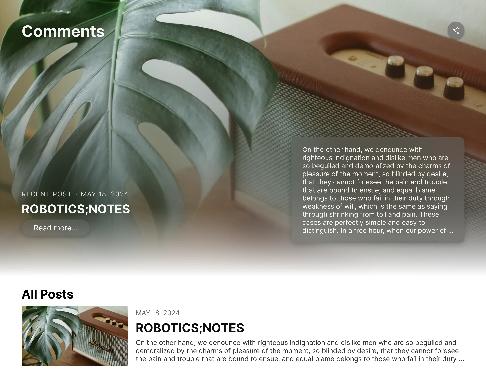

> 我走的时候，我还不知道曾经的生活有一天，会需要证明。
>
> 
—— 刘亮程《今生今世的证据》

---

初入前端，写的是 WinForms。彼时，我初中，学着信息奥赛，写着 C++。我的两位同学开始尝试着写终端小游戏，一位写文字冒险，一位写对对碰。我并没有什么写游戏的灵光，于是带上两位的游戏，写了个小程序：按 1 打开文字冒险，按 2 打开对对碰。我直白的叫它 “Switcher”。

我现在觉得这是此后一切的开端，我从此走上一条不同寻常的路。

我开始不满足于终端，我开始觉得，跑在终端的程序好无聊——永远的黑底白字、永远的文字交互。我想要按钮！闪闪发亮的按钮！那一圈蓝色的描边，那方方正正的形状，多么美妙绝伦，令我如痴如醉。

<WindowsButton />

我尽力还原了

于是我开始尝试 WinForms。彼时的我根本不懂什么是 “布局”、什么是 “锚点”、什么是 “响应式”，只是惊叹于拖拽控件就可以运行的神奇。我第一次看到算法之外的代码世界：文件、进程、网络......一切都如此陌生，却又如此有趣。虽然成果异常粗糙，错误遍地都是，但是探索着的我很满足。

我很快离开了信息奥赛的训练队伍，因为我为一台引导损坏的电脑重新安装了系统，格式化了原有的保护程序但又无法恢复。平心而论，现在的我并不后悔。我本就不擅长算法，又或者说，不擅长竞赛。后来在高中，我又试过数学和物理竞赛，前者半途而废，也从未在后者上获得像样的成就。或许我可以辩解心不在此，但我只觉得智商不够。

后来高中配了用来记笔记的平板，还可以截教室电脑的屏幕。我拷贝了电脑上的程序，带回家分析研究。为了破解这个程序，我学了逆向，学了抓包，为了给界面加个背景，入门了 WPF。[防护屡次升级](/blog/zy/2.0.8-changes/)、我一再努力解决。我修修补补，维护了这个满身补丁的程序一年，随后整理了协议，重写了整个程序。在没有手机的日子里，我用这个程序在后台偷偷截取着网页，贪婪地获取外界的信息。

第一次写起前端三件套，是为了给那截图程序写个网页。说来好笑，最初的我误入 React，不久便转向 Vue，契机是我无法理解什么是 `useEffect`。而到现在，我也说不清到底什么是副作用。

我就这样游走，见招拆招边走边学。我学会过很多，我学不会的很多，我学了却又忘了的也很多。也许这就是学习。那些学不会的鬼魂永远游荡在你的身边迫使你改变前进的方向，那些学会过的却又如浮云不知何时就会离你而去。

其实我是个很三分钟热度的人。曾经试过各种运动，篮球、乒乓、羽毛球，没有一个坚持到现在。至于健身、减肥，也是三天打鱼两天晒网。我画出过不少满意的设计稿，热情却在完成的同时消散。我无法写下实现设计稿的代码，烂尾对我而言可能是常态。

曾经幻想过的博客设计稿

前两天某群友说了这两句话，我思考了一晚，写下这篇文章。

<ChatView :messages="['我不知道，但我只是感觉记忆褪色的话很可惜', '所以，哪怕记录本质上是严重的降维，我也想把这些记忆留下来']" />

我向来没有记录的习惯，因为我自以为我的记忆还不错。可现在回望，许多细节已然佚失。时间模糊了我的记忆，试图埋葬我的过去。我很庆幸在那个以重装系统为乐的年纪摸索会了一点 Git，庆幸加入了 GitHub，庆幸还能找到我写下的[第一个程序](https://github.com/illusionaries/Switcher)、[第一个网页](https://github.com/illusionaries/and-i-quote)、[第一个被合并的 PR](https://github.com/Messiahhh/wenku8-downloader/pull/16)，庆幸留下了今生今世的证据。可代码之外呢？似乎从未有过记录。

突然觉得 “备忘录” 这个名字很有趣。记录，预备着遗忘的那一天。可多久之后我会遗忘呢？在这之后，我还会翻出这篇文章，和这篇文章之后，或许有或许没有的其他文章，然后看着、回忆着吗？我还能想起此时此刻、彼时彼刻的心境吗？

我有 86 条备忘录，大部分是随手创建的草稿。其中有七条被我置顶：

1. 力学考前整理的内容
2. 高数考前整理的内容（上、下）
3. 电磁学考前整理的内容
4. 数理方法考前整理的内容
5. 模电考前整理的内容
6. 集成电路器件原理考前整理的内容

我知道，明天的考场上，这些会被我遗忘，所以我记录。可我不知道，十年后的人生路上，哪些会被我遗忘，所以我不知从何下笔。文字难以捕捉的微小细节，却最先遗失在时间的长河中。

小学的时候，我在课外学英语，比同龄人早了两三年。我的同学在一个字母一个字母拼读单词的时候，我已经掌握了 Phonics。我因此短暂获得过更大的词汇量和更好的口语。我还记得小学时，我向英语老师炫耀我认识 Christmas，初一时炫耀我知道 Canadian 是 /kəˈneɪdɪən/ 而不是 /'kanədɪən/。我没有背过应用文模版，也嘲笑着高分句式的古板。现如今却只觉自己可笑。初中开始我不再课外学习英语，这份自傲却一直伴我到高中。高三时，我的同学已经能流畅写出应用文和读后续写中的金句，我却攥着我多年没有扩充的可怜词汇，挑挑拣拣词不达意。

自从高中毕业，就再也没写过长篇的文字。现在不只是英语难以表达，中文也只勉勉强强。大语言模型生成的文字正蚕食着我本就微薄的语言能力。是的✅，我正**直指问题的核心🎯**，而我的发现**非常关键**✨——打个比方，这就好比是向 “涓流💧” 中倒入 “污水☠️”，后果**不堪设想**😨！这不仅是自然的 “**衰退⬇️**”，更是有计划的 “**谋杀🔪**”！

高中时为了那篇 60 分的作文，专项训练过开头：你首先需要个引子，名人名言为佳，再次找些实事热点，然后展开一小段的论证，最后巧妙引入中心论点。两段，在那种三列的作文纸上，占半列不到些，140 字，中规中矩。我至少从语文老师那拿到过十几个作文题，只写开头。可是从来没有人教过我如何结尾，我只知道当我写过 “▲ 800 字” 这个符号，我的任务就已完成，只需大致重申论点，随意总结两句、画上句号，便可停笔等待收卷。

所以我不太会结尾。但这又何妨？人生的 “▲ 800 字” 在哪里呢？

我希望我不需要为自己画上句号。

